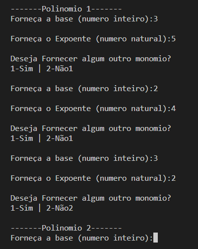
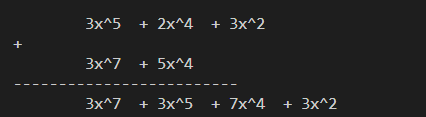

# Soma-de-Polinomios
 Realiza a soma de dois polinomios fornecidos pelo usuário, estes polinomio são formados atráves dos monomio fornecidos pelo usuário

Feito para a resolução de uma atividade da lista de exercicios de Estruturas de Dados 1 na graduação em Sistemas para a internet pelo IF Sudeste MG-Capus Barbacena

## Imagens da execução

### Obtendo o polinomio 1



### Resultado da soma de dois polinomios




## Tecnoligia usada
 Linguagem C em modo texto;
 
# Como Executar 
Requisitos 
Compilador gcc instalado
```bash
# clonar repositório 
git clone https://github.com/VitorSVNascimento/Soma-de-Polinomios   
# entrar na pasta do projeto
cd Soma-de-Polinomios
# compile o código
gcc *.c -o nomeExcutavel
# executar o código
./nomeExecutavel
```

